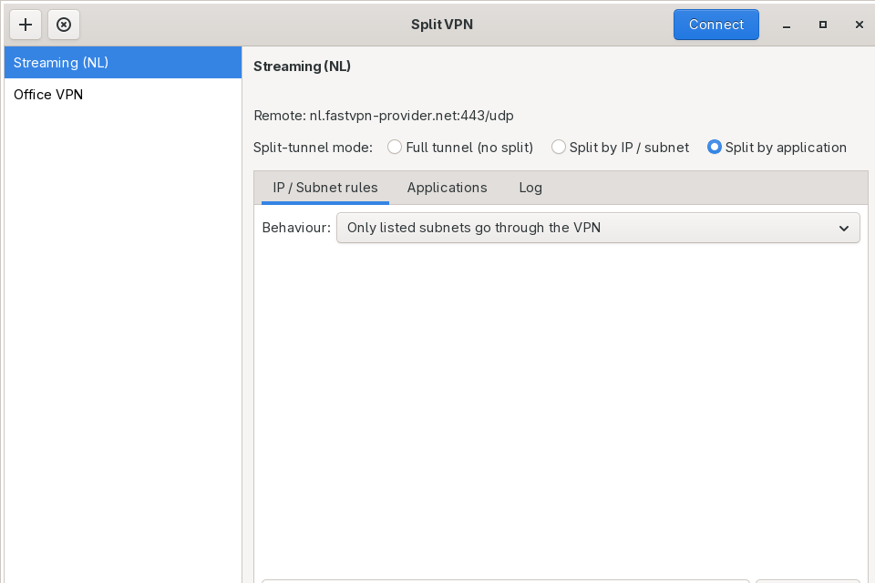
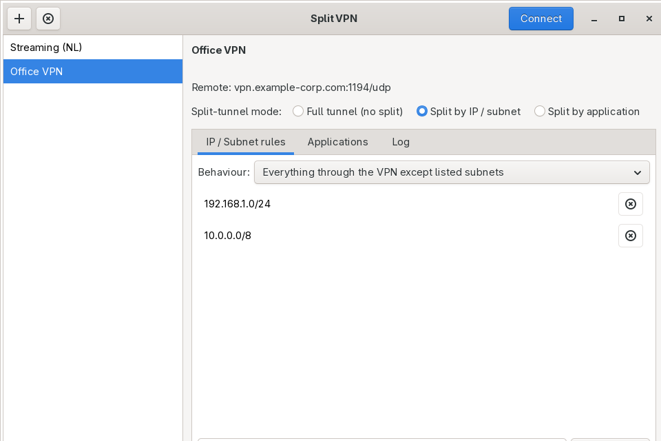

# Split VPN

[Русская версия](README.ru.md)

A desktop app for Arch Linux that lets you run OpenVPN **selectively** —
instead of "everything goes through the VPN or nothing does", you choose
exactly what uses the tunnel.

## Why would I want this?

Normally, connecting to a VPN routes *all* of your computer's traffic
through it. That's often not what you actually want:

- You need your work VPN on to reach internal servers, but you don't want
  your video calls or downloads dragged through it too.
- You want your torrent client (or one specific app) to always go through
  a VPN, without routing your browser or everything else through it.
- You want to reach devices on your home network (printer, NAS, router)
  while a "everything through the VPN" connection is active, instead of
  losing access to your LAN.

Split VPN solves this with two switches you can flip per profile:

- **By subnet** — you list IP ranges. Either *only* those go through the
  VPN, or *everything except* those does. The rest of your traffic
  behaves exactly as if the VPN weren't running.
- **By application** — you pick specific apps. Only traffic from those
  apps uses the VPN; the rest of your system is completely unaffected,
  as if it were on a separate computer.

It's a normal GTK desktop app: import a `.ovpn` file you already have
(from your VPN provider, employer, or your own server), pick a mode,
click Connect.

## What it looks like





## Installing (Arch Linux)

```bash
pacman -S --needed python python-gobject gtk3 openvpn iproute2 iptables util-linux polkit python-build python-installer python-wheel python-setuptools
git clone https://github.com/mixa12344321/splitvpn.git
cd splitvpn
makepkg -si
```

That installs `splitvpn` in your application menu, plus the `splitvpn`
and `splitvpn-helper` commands.

## Quick start

1. Open **Split VPN**.
2. Click **+** and pick a `.ovpn` file (the one your VPN provider gave
   you, or your own). If it came with separate certificate/key files in
   the same folder, those get picked up automatically.
3. Choose a mode for that profile:
   - **Full tunnel** — normal VPN behavior, nothing split.
   - **Split by IP/subnet** — add the addresses you care about, and pick
     whether they're the *only* thing that uses the VPN or the *only*
     thing excluded from it.
   - **Split by application** — add the apps that should use the VPN
     (pick one from your installed apps, or type a command).
4. Click **Connect**. If your VPN needs a username and password, you'll
   be asked for them first. Your system will ask for your password once
   too — that's normal, it's how the app gets permission to change
   network routes.
5. For "split by application", once it says "connected", press
   **Launch** next to each app you added — that's the copy of the app
   that will actually use the VPN.

The **Log** tab shows OpenVPN's own output if a connection doesn't come
up the way you expect.

## What each mode is good for

**Split by subnet** is the right choice when you think in terms of
*addresses* — "I need to reach 10.0.0.0/8 at the office" or "keep my home
network reachable while connected". It affects your whole system's
routing table for those specific ranges; everything else is untouched.

**Split by application** is the right choice when you think in terms of
*programs* — "only my browser should use the VPN" or "only this one app
should look like it's coming from a different country". Nothing outside
the apps you explicitly launch through Split VPN is affected at all, even
if the VPN handles a full "route everything" configuration internally.

## Things to know before you rely on it

- Only IPv4 addresses can be split by subnet right now. In "everything
  except listed subnets" mode, IPv6 is turned off for your whole system
  while connected, specifically so it can't quietly bypass the VPN — it's
  turned back on automatically when you disconnect.
- Split-by-application works for the great majority of desktop apps,
  including graphical ones (it launches them the normal way, just with
  different network routing).
- This has been built and tested against a real Arch Linux system,
  including real traffic flowing through both split modes — see
  [Testing notes](#testing-notes) below for exactly what was and wasn't
  covered, and a checklist to run through with your own VPN provider
  before trusting it fully.

## Localization

The interface is in English by default and switches to Russian
automatically if your system language is Russian (standard Linux
`LANGUAGE`/`LANG` environment variables — no in-app switcher). Want
another language? Translation files live in
[`splitvpn/locale/`](splitvpn/locale/) and contributions are welcome.

---

## How it works under the hood

*(You don't need any of this to use the app — it's here for anyone
curious, packaging it, or contributing.)*

```
GUI (unprivileged, GTK3)  ──pkexec──▶  splitvpn-helper (root)
     reads /run/splitvpn/*/state.json     │
     directly for status, no pkexec       ├─ writes an augmented .ovpn
     needed for polling                   ├─ launches `openvpn --daemon`
                                           ├─ (per-app mode) sets up a
                                           │   netns + veth + NAT first
                                           └─ openvpn's --up/--down hooks
                                              call back into the helper
                                              to apply/tear down routes
```

- `splitvpn` — the GTK GUI. Runs as your normal user. Never touches the
  network directly.
- `splitvpn-helper` — a root-only CLI, invoked via `pkexec`. This is the
  only part of the program that runs privileged operations (`ip`,
  `iptables`, `ip netns`, launching `openvpn`).
- State for active sessions lives under `/run/splitvpn/<session>/`
  (tmpfs, cleared on reboot) and is written world-readable so the GUI can
  poll status/log without repeated authentication prompts. Only mutating
  actions (connect/disconnect/launch-app) go through `pkexec`.
- Imported profiles (plus any cert/key files they reference by relative
  path) are copied into `~/.config/splitvpn/profiles/<id>/`.

### Split by IP/subnet, technically

OpenVPN is launched with `route-noexec` and `pull-filter ignore` on
`redirect-gateway`/`route`, so it never touches the routing table itself.
Once the tunnel is up, the `--up` hook adds exactly the routes you asked
for (via `ip route replace`), and the `--down` hook removes them. In
"everything except listed subnets" mode, IPv6 is temporarily disabled
system-wide for the session so it can't bypass the tunnel.

### Split by application, technically

A dedicated network namespace + veth pair is created, NATed through your
normal default interface. OpenVPN itself runs *inside* that namespace
with completely normal (non-split) behavior — its full-tunnel default
route only exists inside the namespace, so it never affects the rest of
the system. Clicking "Launch" next to an app runs it inside the namespace
as your own user (via `setpriv`, not root), inheriting `DISPLAY`/
`WAYLAND_DISPLAY`/`XAUTHORITY`/`DBUS_SESSION_BUS_ADDRESS` so GUI apps keep
working normally.

### Manual / dev install (without packaging)

```bash
pip install --user .
```

This creates the same `splitvpn` / `splitvpn-helper` console scripts via
the `[project.scripts]` entry points in `pyproject.toml`. You'll still
need `python-gobject`, `gtk3`, `openvpn`, `iproute2`, `iptables`,
`util-linux` and `polkit` installed system-wide (PyGObject binds to the
system GTK).

## Known limitations (v1)

- IPv4 only for split-by-IP routing; IPv6 is force-disabled for the
  duration of an "everything except listed subnets" session as a leak
  guard, rather than being split itself.
- One active split-by-application session uses one dedicated `/30` out of
  `10.200.0.0/16` per session; that's up to ~248 concurrent netns
  sessions, which is far more than anyone needs in practice.
- No IPv6 support inside the per-application namespace either — apps
  there simply won't have an IPv6 route (fails closed, not a leak).
- `/run/splitvpn` isn't proactively cleaned up on disconnect (logs are
  kept for troubleshooting); it's tmpfs, so it clears on reboot. Remove a
  stale `/run/splitvpn/<session>/` by hand if needed.
- Assumes a routed (`dev tun`, not `dev tap`) OpenVPN client config, which
  covers the overwhelming majority of provider-supplied `.ovpn` files.

## Testing notes

This has been built and exercised end to end on a real Arch Linux system
(WSL2) — package built with `makepkg`, installed, and run against a local
OpenVPN test server for both split-by-subnet modes and split-by-
application (netns) mode, including real traffic crossing the tunnel,
disconnect/route-restore, and recovery after a hard `kill -9` of the
openvpn process. The GTK GUI itself was rendered and driven under Xvfb
(virtual display) and screenshotted, in both English and Russian, since
the test environment had no display server for live mouse interaction.
Several real bugs turned up during that testing and were fixed (see the
git log).

What's **not** yet been exercised: a real TLS/certificate-based provider
`.ovpn` (only a static-key config was used as the test target), live
mouse-driven usage of the GUI, and bare-metal Arch (WSL2's kernel/
networking is close to but not identical to bare metal).

### Checklist before you trust it with real traffic

- [ ] Import a real `.ovpn` and confirm **Full tunnel** mode connects and
      `curl ifconfig.me` (or similar) shows the VPN's exit IP.
- [ ] Switch to **Split by IP/subnet → include only**, add a single test
      CIDR (e.g. a server you control), connect, and confirm `ip route`
      shows a route to it via `tunX` while your normal default route is
      untouched, and unrelated traffic still exits normally.
- [ ] Switch to **exclude listed subnets**, add your LAN CIDR, connect,
      and confirm you can still reach LAN devices while general traffic
      goes through the VPN. Confirm `sysctl net.ipv6.conf.all.disable_ipv6`
      reads `1` while connected and `0` again after disconnecting.
- [ ] Switch to **Split by application**, add e.g. `xterm` (or a browser),
      connect, click Launch, and confirm (inside that app) traffic exits
      via the VPN while a normal terminal on the host still exits
      normally.
- [ ] Disconnect from each mode and confirm `ip route`, `ip netns list`,
      and `iptables -L -t nat` are back to how they were before connecting.
- [ ] Kill `openvpn` externally (`kill -9`) while connected and confirm
      the GUI notices ("error (process exited)") instead of hanging on
      "connecting" forever, and that `splitvpn-helper disconnect` still
      cleans up leftover routes/namespaces.

## Security notes

- `splitvpn-helper` is the only component that runs as root, and only for
  the duration of each `connect`/`disconnect`/`run-app` call — it's
  invoked fresh via `pkexec` each time, never left running as a
  standing privileged daemon.
- Credentials typed into the "VPN credentials" dialog are written to a
  `0600` temp file, copied by the root helper into the session directory,
  and never touch the GUI process's own long-lived storage.
- All subprocess calls use argument lists (never `shell=True`), and
  CIDRs are validated with Python's `ipaddress` module before being
  handed to `ip route`.
