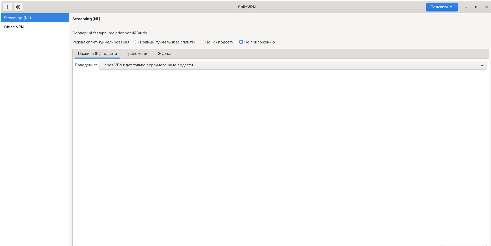
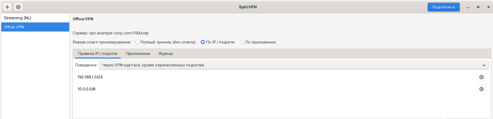

# Split VPN

[English version](README.md)

Приложение для Arch Linux, которое позволяет использовать OpenVPN
**выборочно** — вместо привычного «либо весь трафик через VPN, либо
никакой», вы сами решаете, что именно идёт через туннель.

## Зачем это нужно?

Обычно подключение к VPN заворачивает *весь* трафик компьютера через
него. Часто это не то, что нужно на самом деле:

- Рабочий VPN нужен, чтобы достучаться до внутренних серверов, но
  совсем не нужно, чтобы через него же шли видеозвонки и загрузки файлов.
- Хочется, чтобы конкретное приложение (например, торрент-клиент) всегда
  ходило через VPN, но при этом браузер и всё остальное — напрямую.
- Хочется оставаться в домашней сети (принтер, NAS, роутер) даже когда
  активно подключение «всё через VPN», вместо того чтобы терять доступ
  к локальной сети.

Split VPN решает это двумя переключателями на каждый профиль:

- **По подсети** — вы перечисляете диапазоны IP-адресов. Либо через VPN
  идут *только* они, либо через VPN идёт *всё, кроме* них. Остальной
  трафик ведёт себя точно так же, как если бы VPN вообще не был запущен.
- **По приложению** — вы выбираете конкретные программы. Через VPN идёт
  только трафик этих программ; остальная система вообще не затрагивается,
  как будто это отдельный компьютер.

Это обычное GTK-приложение: импортируете уже имеющийся файл `.ovpn` (от
провайдера VPN, работодателя или собственного сервера), выбираете режим,
жмёте «Подключить».

## Как это выглядит





## Установка (Arch Linux)

```bash
pacman -S --needed python python-gobject gtk3 openvpn iproute2 iptables util-linux polkit python-build python-installer python-wheel python-setuptools
git clone https://github.com/mixa12344321/splitvpn.git
cd splitvpn
makepkg -si
```

Это установит **Split VPN** в меню приложений, а также команды
`splitvpn` и `splitvpn-helper`.

## Быстрый старт

1. Откройте **Split VPN**.
2. Нажмите **+** и выберите файл `.ovpn` (тот, что выдал провайдер VPN,
   или свой собственный). Если рядом с ним лежат отдельные файлы
   сертификатов/ключей, они подхватятся автоматически.
3. Выберите режим для этого профиля:
   - **Full tunnel** — обычное поведение VPN, без разделения трафика.
   - **Split by IP/subnet** — добавьте нужные адреса и укажите, единственные
     ли они идут через VPN или, наоборот, единственные исключённые.
   - **Split by application** — добавьте приложения, которые должны
     ходить через VPN (выберите из установленных или введите команду).
4. Нажмите **Connect**. Если VPN требует логин и пароль, их сначала
   спросят. Система один раз попросит и ваш системный пароль — это
   нормально, так приложение получает разрешение менять сетевые маршруты.
5. В режиме «по приложению», как только появится «connected», нажимайте
   **Launch** рядом с каждым добавленным приложением — это и есть та
   копия приложения, которая реально пойдёт через VPN.

Вкладка **Log** показывает собственный вывод OpenVPN, если соединение
поднимается не так, как ожидалось.

## Для чего какой режим

**Разделение по подсети** подходит, когда вы думаете в терминах
*адресов* — «мне нужно достучаться до 10.0.0.0/8 в офисе» или «оставить
доступной домашнюю сеть, пока подключён VPN». Это влияет на таблицу
маршрутизации всей системы, но только для этих конкретных диапазонов;
всё остальное не затрагивается.

**Разделение по приложению** подходит, когда вы думаете в терминах
*программ* — «через VPN должен ходить только браузер» или «только это
одно приложение должно выглядеть так, будто оно из другой страны».
Ничего, кроме приложений, явно запущенных через Split VPN, вообще не
затрагивается, даже если сам VPN настроен на полный «маршрутизировать
всё» режим внутри своего изолированного пространства.

## Что стоит знать перед тем как полагаться на это

- Разделение по подсети пока работает только с IPv4-адресами. В режиме
  «всё, кроме перечисленных подсетей» IPv6 на время подключения
  отключается во всей системе — специально, чтобы он не смог незаметно
  обойти VPN, — и включается обратно автоматически при отключении.
- Разделение по приложению работает для подавляющего большинства
  desktop-приложений, включая графические (они запускаются обычным
  образом, просто с другой сетевой маршрутизацией).
- Приложение собрано и протестировано на настоящей системе Arch Linux,
  включая реальный трафик через оба режима сплита — подробности и
  чек-лист для проверки с собственным VPN-провайдером смотрите в разделе
  [Заметки о тестировании](#заметки-о-тестировании) ниже.

## Локализация

Интерфейс по умолчанию на английском и автоматически переключается на
русский, если у вас в системе установлен русский язык (обычные для
Linux переменные окружения `LANGUAGE`/`LANG` — переключателя языка внутри
приложения нет). Хотите другой язык? Файлы перевода лежат в
[`splitvpn/locale/`](splitvpn/locale/), контрибуции приветствуются.

---

## Как это устроено внутри

*(Для использования приложения это знать не обязательно — раздел для
тех, кому интересно, кто занимается упаковкой или хочет контрибьютить.)*

```
GUI (без прав root, GTK3)  ──pkexec──▶  splitvpn-helper (root)
     читает /run/splitvpn/*/state.json   │
     напрямую для статуса, pkexec        ├─ пишет дополненный .ovpn
     для опроса не нужен                 ├─ запускает `openvpn --daemon`
                                          ├─ (режим per-app) сначала
                                          │   поднимает netns + veth + NAT
                                          └─ хуки --up/--down у openvpn
                                             вызывают хелпер обратно,
                                             чтобы применить/откатить маршруты
```

- `splitvpn` — GTK-интерфейс. Работает от вашего обычного пользователя.
  Никогда напрямую не трогает сеть.
- `splitvpn-helper` — CLI, работающий только от root, вызывается через
  `pkexec`. Это единственная часть программы, которая выполняет
  привилегированные операции (`ip`, `iptables`, `ip netns`, запуск
  `openvpn`).
- Состояние активных сессий лежит в `/run/splitvpn/<session>/` (tmpfs,
  очищается при перезагрузке) и пишется доступным на чтение всем, чтобы
  GUI мог опрашивать статус/лог без повторных запросов авторизации.
  Через `pkexec` идут только изменяющие действия (connect/disconnect/
  запуск приложения).
- Импортированные профили (вместе с любыми файлами сертификатов/ключей,
  на которые они ссылаются по относительному пути) копируются в
  `~/.config/splitvpn/profiles/<id>/`.

### Сплит по IP/подсети — технически

OpenVPN запускается с `route-noexec` и `pull-filter ignore` на
`redirect-gateway`/`route`, поэтому сам он никогда не трогает таблицу
маршрутизации. Как только туннель поднят, хук `--up` добавляет ровно те
маршруты, которые вы указали (через `ip route replace`), а хук `--down`
их убирает. В режиме «всё, кроме перечисленных подсетей» на время сессии
IPv6 временно отключается во всей системе.

### Сплит по приложению — технически

Создаётся отдельный network namespace + пара veth, NAT'ится через ваш
обычный интерфейс по умолчанию. Сам OpenVPN работает *внутри* этого
namespace в совершенно обычном (не сплит) режиме — его маршрут по
умолчанию на весь туннель существует только внутри namespace, поэтому
никогда не затрагивает остальную систему. Клик по «Launch» рядом с
приложением запускает его внутри namespace от имени вашего собственного
пользователя (через `setpriv`, не от root), с наследованием
`DISPLAY`/`WAYLAND_DISPLAY`/`XAUTHORITY`/`DBUS_SESSION_BUS_ADDRESS`, чтобы
графические приложения продолжали работать как обычно.

### Установка вручную / для разработки (без пакета)

```bash
pip install --user .
```

Это создаёт те же консольные команды `splitvpn` / `splitvpn-helper` через
`[project.scripts]` в `pyproject.toml`. Всё равно понадобятся системные
`python-gobject`, `gtk3`, `openvpn`, `iproute2`, `iptables`, `util-linux`
и `polkit` (PyGObject связывается с системным GTK).

## Известные ограничения (v1)

- Сплит по IP работает только с IPv4; в режиме «всё, кроме перечисленных
  подсетей» IPv6 принудительно отключается на время сессии как защита от
  утечки, а не сплитуется сам по себе.
- Одна активная сессия сплита по приложению использует один выделенный
  `/30` из `10.200.0.0/16`; это до ~248 одновременных netns-сессий, что
  на практике намного больше, чем кому-либо нужно.
- Внутри per-app namespace тоже нет поддержки IPv6 — у приложений там
  просто не будет IPv6-маршрута (закрывается по умолчанию, а не течёт).
- `/run/splitvpn` не вычищается проактивно при отключении (логи
  сохраняются для отладки); это tmpfs, так что всё очищается при
  перезагрузке. Осиротевший `/run/splitvpn/<session>/` можно удалить
  вручную при необходимости.
- Предполагается маршрутизируемый (`dev tun`, а не `dev tap`) клиентский
  конфиг OpenVPN, что покрывает подавляющее большинство `.ovpn`-файлов от
  провайдеров.

## Заметки о тестировании

Приложение собрано и прогнано целиком на настоящей системе Arch Linux
(WSL2) — пакет собран через `makepkg`, установлен, и запущен против
локального тестового сервера OpenVPN в обоих режимах сплита (по подсети
и по приложению/netns), включая реальный трафик через туннель,
восстановление маршрутов при отключении и восстановление после жёсткого
`kill -9` процесса openvpn. Сам GTK GUI был отрисован и прогнан через
виртуальный дисплей Xvfb и заскриншочен — как на английском, так и на
русском — поскольку в тестовой среде не было дисплея для живого
взаимодействия мышью. В ходе этого тестирования нашлись и были
исправлены несколько реальных багов (см. git log).

Что **пока не** проверено: настоящий провайдерский `.ovpn` с
TLS/сертификатами (тестовой целью был конфиг на статическом ключе), живое
использование GUI мышью, и голое железо Arch (сеть и ядро WSL2 близки к
нативным, но не идентичны).

### Чек-лист перед тем как доверить реальный трафик

- [ ] Импортируйте настоящий `.ovpn` и убедитесь, что режим **Full
      tunnel** подключается, а `curl ifconfig.me` (или аналог) показывает
      выходной IP VPN.
- [ ] Переключитесь на **Split by IP/subnet → include only**, добавьте
      один тестовый CIDR (например, сервер, который вы контролируете),
      подключитесь и убедитесь, что `ip route` показывает маршрут к нему
      через `tunX`, а обычный маршрут по умолчанию не тронут, и остальной
      трафик по-прежнему выходит как обычно.
- [ ] Переключитесь на **exclude listed subnets**, добавьте CIDR своей
      локальной сети, подключитесь и убедитесь, что устройства в LAN
      по-прежнему доступны, пока остальной трафик идёт через VPN.
      Проверьте, что `sysctl net.ipv6.conf.all.disable_ipv6` возвращает
      `1` при подключении и снова `0` после отключения.
- [ ] Переключитесь на **Split by application**, добавьте, например,
      `xterm` (или браузер), подключитесь, нажмите Launch и убедитесь,
      что (внутри этого приложения) трафик выходит через VPN, а обычный
      терминал на хосте по-прежнему выходит как обычно.
- [ ] Отключитесь из каждого режима и убедитесь, что `ip route`,
      `ip netns list` и `iptables -L -t nat` вернулись к состоянию до
      подключения.
- [ ] Убейте `openvpn` извне (`kill -9`) во время подключения и
      убедитесь, что GUI это замечает («error (process exited)») вместо
      бесконечного «connecting», и что `splitvpn-helper disconnect`
      всё равно вычищает оставшиеся маршруты/namespace'ы.

## Заметки о безопасности

- `splitvpn-helper` — единственный компонент, работающий от root, и
  только на время каждого вызова `connect`/`disconnect`/`run-app` — он
  каждый раз запускается заново через `pkexec`, никогда не остаётся
  висеть как постоянный привилегированный демон.
- Учётные данные, введённые в диалоге «VPN credentials», записываются во
  временный файл с правами `0600`, копируются root-хелпером в каталог
  сессии и никогда не попадают в долгоживущее хранилище самого GUI-
  процесса.
- Все вызовы подпроцессов используют списки аргументов (никогда
  `shell=True`), а CIDR перед передачей в `ip route` проверяются модулем
  `ipaddress` из стандартной библиотеки Python.
